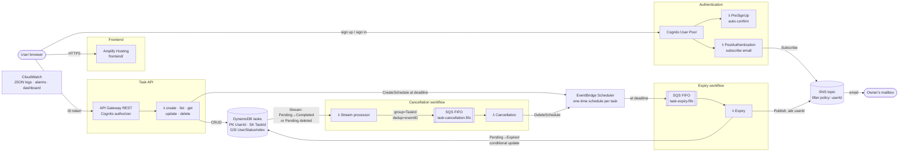

# Serverless To-Do App with Event-Driven Expiry Processing

A fully serverless task manager:
- **Sign-up and sign-in:** users sign up and sign in with email and password through Amazon Cognito.
- **Tasks:** users create, view, update and delete their own tasks.
- **Expiry:** a task still **Pending** at its deadline (5 minutes after creation by default) is marked **Expired** automatically, and the owner gets an email.
- **Cancellation:** completing or deleting a task before its deadline cancels its scheduled expiry. This runs through DynamoDB Streams, SQS FIFO and Lambda.

All backend infrastructure **and the Amplify frontend** are defined in one AWS SAM template, [backend/template.yaml](backend/template.yaml). It deploys through a SAM pipeline running on GitHub Actions.

```
backend/                         SAM application
  template.yaml                  all AWS resources (incl. AWS::Amplify::App / Branch)
  samconfig.toml                 deploy settings (stack serverless-todo-dev)
  src/                           Lambda code (Python 3.14)
    tasks_api.py                   CRUD handlers (API Gateway)
    auth_triggers.py               Cognito PreSignUp + PostAuthentication
    expiry.py                      expiry handler (SQS FIFO consumer)
    stream_processor.py            DynamoDB Stream -> cancellation FIFO queue
    cancellation.py                cancellation handler (SQS FIFO consumer)
    common.py                      shared helpers
  tests/                         unit tests (pytest + moto)
frontend/                        Vite + aws-amplify (Auth) single-page app, hosted on AWS Amplify
docs/architecture.drawio         network/architecture diagram (open with draw.io / diagrams.net)
.github/workflows/
  backend-pipeline.yml           test -> build -> deploy (SAM pipeline, GitHub OIDC)
  frontend-ci.yml                frontend build check (Amplify does the hosting builds)
```

## Architecture

Full diagram: [docs/architecture.drawio](docs/architecture.drawio). Open it at https://app.diagrams.net or with the draw.io VS Code extension.



### AWS services

| Service | Used for |
|---|---|
| **Amazon Cognito User Pool** | Email/password sign-up and sign-in. The **PreSignUp** trigger auto-confirms users. The **PostAuthentication** trigger subscribes the user's email to SNS. |
| **Amazon API Gateway (REST)** | `/tasks` CRUD endpoints, protected by a Cognito User Pool authorizer |
| **AWS Lambda** | 5 CRUD handlers, 2 Cognito triggers, expiry handler, stream processor, cancellation handler |
| **Amazon DynamoDB** | One On-Demand table; Streams turned on for the cancellation workflow |
| **Amazon EventBridge (Scheduler)** | One one-time `at(...)` schedule per task, fired at its deadline |
| **Amazon SQS FIFO** | `task-expiry.fifo` (expiry events) and `task-cancellation.fifo` (cancellation events), each with a FIFO dead-letter queue |
| **Amazon SNS** | Email notifications. Each subscription has a `userId` filter policy, so users only get emails about their own tasks. |
| **Amazon CloudWatch** | JSON-structured Lambda logs with retention, API metrics, alarms and an operations dashboard |
| **AWS Amplify Hosting** | Hosts the `frontend/` app. Defined in the SAM template, which also sets its environment variables. |

## How it works

### Data model (one-table design)

| Attribute | Notes |
|---|---|
| `UserId` | **Partition key**: the Cognito `sub` of the owner (taken from the authorizer claims, never from the request body) |
| `TaskId` | **Sort key**: a UUID v4 |
| `Description` | Required, at most 500 characters |
| `Date` | Task date, `YYYY-MM-DD` (defaults to today) |
| `Status` | `Pending`, `Completed` or `Expired` |
| `Deadline` | ISO-8601 UTC. Defaults to **creation time + 5 minutes** (`DefaultDeadlineMinutes`). |
| `ScheduleName`, `CreatedAt`, `UpdatedAt`, `CompletedAt`, `ExpiredAt`, `NotifiedAt` | Bookkeeping fields |

The GSI `UserStatusIndex` (`UserId` + `Status`) serves `GET /tasks?status=Pending|Completed|Expired`. Because every key begins with `UserId`, a user can only ever query their own tasks.

### API (all endpoints need `Authorization: <Cognito ID token>`)

| Method & path | Behaviour |
|---|---|
| `POST /tasks` | Body `{"Description", "Date"?, "Deadline"?}`. Creates a `Pending` task and its expiry schedule. → `201` |
| `GET /tasks[?status=]` | Lists the caller's tasks, newest first |
| `GET /tasks/{taskId}` | Gets one task (`404` if it isn't the caller's) |
| `PUT /tasks/{taskId}` | Body `{"Description"?, "Date"?, "Status"?: "Completed"}`. The only allowed status change is `Pending → Completed`, otherwise `409`. |
| `DELETE /tasks/{taskId}` | Deletes the task. → `204` |

### Expiry workflow
1. `POST /tasks` creates a one-time **EventBridge Scheduler** schedule `task-<TaskId>` with `at(<Deadline>)` in UTC and `ActionAfterCompletion=DELETE`. Its target is the **SQS FIFO** queue `task-expiry.fifo`, with message group = TaskId. If the schedule can't be created, the task is rolled back.
2. At the deadline, the **Expiry Lambda** consumes the message and makes a *conditional* update: `Status = Expired` only if it is still `Pending`. Completed or deleted tasks are left alone.
3. It then publishes to **SNS** with the message attribute `userId`. Only the owner's subscription filter matches, so only the owner gets the email.
4. Retries are safe: `NotifiedAt` is recorded after sending, so a redelivered message never sends a second email. A failure between the update and the publish is retried until the email goes out.

### Cancellation workflow (DynamoDB Streams → Lambda → SQS FIFO → Lambda)
1. Completing a task (`Pending→Completed`) or deleting a `Pending` task writes a **DynamoDB Stream** record. The event source mapping's **filter criteria** pass only those two cases to the **Stream processor Lambda**.
2. The stream processor sends `{taskId, userId, scheduleName, reason}` to **`task-cancellation.fifo`**:
   - `MessageGroupId = TaskId`, so events for the same task stay in order.
   - `MessageDeduplicationId` = the stream record's `eventID`, so a retried stream batch doesn't create duplicates.
3. The **Cancellation Lambda** calls `scheduler:DeleteSchedule`. `ResourceNotFound` (already cancelled, or already fired and auto-deleted) counts as success, so the workflow is **idempotent**.
4. The workflow is **decoupled**: the API never calls the scheduler to cancel. It only changes data, and the events do the rest.

Reliability:
- Failures are reported per message (`ReportBatchItemFailures`). On FIFO queues the failed message *and every later one* in the batch are retried, which keeps per-task ordering.
- After 5 failed attempts, messages go to dead-letter queues: FIFO DLQs for both queues, a standard DLQ for schedule delivery, and an on-failure SQS destination for the stream.

### Authentication
- **PreSignUp** sets `autoConfirmUser` and `autoVerifyEmail`, so sign-up needs no verification code. Cognito can't auto-confirm on its own, so this trigger is required.
- **PostAuthentication** runs on every sign-in. If the user's email isn't subscribed to the SNS topic yet, it subscribes it with the filter policy `{"userId": ["<sub>"]}`. It never throws, so an SNS problem can't block sign-in.
- **SNS sends a confirmation email after the first sign-in.** The user must click *Confirm subscription* before expiry emails can arrive (an AWS rule for email subscriptions).

### Least-privilege IAM
Each function has its own role, limited to the exact actions it needs on specific resources:
- CRUD functions:
  - `create` may only `PutItem`/`DeleteItem` on the table, and `CreateSchedule` in this stack's schedule group.
  - `list` may only `Query` the table and its GSI.
- `iam:PassRole` is restricted to the scheduler role, with `iam:PassedToService = scheduler.amazonaws.com`.
- Cancellation may only `DeleteSchedule` in the schedule group.
- Expiry may only `UpdateItem`/`GetItem` and `Publish` to the topic.
- The scheduler role may only `SendMessage` to the expiry queue and its DLQ, and only callers from this account (`aws:SourceAccount`) can assume it.

### Observability (CloudWatch)
- Every function logs in **JSON** to its own log group, with 14-day retention by default.
- API Gateway stage metrics are on.
- Alarms: expiry errors, cancellation-pipeline errors, API 5XX, and messages in any DLQ.
- Dashboard `serverless-todo-dev-operations` shows API traffic, Lambda errors and invocations, queue depths, SNS deliveries and filtered-out counts, and a Logs Insights view of expiry and cancellation events. The `DashboardUrl` stack output links to it.

## Run and test locally

```bash
# Backend unit tests (moto mocks DynamoDB, SNS, SQS and EventBridge Scheduler)
cd backend
python -m venv .venv && . .venv/Scripts/activate   # macOS/Linux: . .venv/bin/activate
pip install -r requirements-dev.txt
python -m pytest -v

sam validate --lint
sam build

# Frontend against a deployed backend
cd ../frontend
cp .env.example .env.local     # fill in from the stack outputs
npm install
npm run dev                    # http://localhost:5173
```

## Deploy

### 1. One-time: SAM pipeline bootstrap (GitHub OIDC, no stored AWS keys)

The IAM trust policy must match the GitHub OIDC `sub` claim exactly. Look up this repo's format first:

```bash
gh api repos/<owner>/serverless-todo-event-driven/actions/oidc/customization/sub
```

If `use_immutable_subject` is `true`, use the ID-qualified names from `sub_claim_prefix`. For this repo they are `--github-org Iradukunda54@267279209 --github-repo serverless-todo-event-driven@1405567111`.

> The stage name `todo-dev` is deliberately unique within the AWS account. Bootstrap stacks are named `aws-sam-cli-managed-<stage>-pipeline-resources`, so reusing a common name like `dev` would overwrite another project's pipeline roles.

```bash
cd backend
sam pipeline bootstrap --no-interactive --no-confirm-changeset \
  --stage todo-dev --region eu-west-1 --cicd-provider github-actions \
  --permissions-provider oidc --oidc-provider github-actions \
  --oidc-provider-url https://token.actions.githubusercontent.com \
  --oidc-client-id sts.amazonaws.com \
  --github-org Iradukunda54@267279209 --github-repo serverless-todo-event-driven@1405567111 \
  --deployment-branch main
```

Then add these **repository variables** (Settings → Secrets and variables → Actions → Variables), taking the values from the outputs of the `aws-sam-cli-managed-todo-dev-pipeline-resources` stack (also saved in [backend/.aws-sam/pipeline/pipelineconfig.toml](backend/.aws-sam/pipeline/pipelineconfig.toml)):

| Variable | Value |
|---|---|
| `AWS_REGION` | `eu-west-1` |
| `PIPELINE_EXECUTION_ROLE` | `PipelineExecutionRole` output |
| `CLOUDFORMATION_EXECUTION_ROLE` | `CloudFormationExecutionRole` output |
| `ARTIFACTS_BUCKET` | `ArtifactsBucket` output (bucket **name**) |

### 2. One-time: GitHub token for Amplify

Amplify needs access to this repo to build `frontend/`:
1. Install the **AWS Amplify GitHub App** on the repository: https://github.com/apps/aws-amplify-eu-west-1/installations/new
2. Create a GitHub personal access token (classic, scope `admin:repo_hook`) and store it as a plain-text secret:

```bash
aws secretsmanager create-secret --region eu-west-1 \
  --name serverless-todo/github-token --secret-string '<token>'
```

[backend/samconfig.toml](backend/samconfig.toml) passes `GitHubTokenSecretName=serverless-todo/github-token`. If you set that parameter to an empty string, the stack deploys without the Amplify app.

### 3. Deploy

Push to `main`. [backend-pipeline.yml](.github/workflows/backend-pipeline.yml) runs:
1. unit tests
2. `sam validate --lint`
3. `sam build`
4. assume the pipeline role through OIDC
5. `sam deploy --config-env dev`

Creating the Amplify branch through CloudFormation doesn't start a build, so start the first frontend build once:

```bash
APP_ID=$(aws cloudformation describe-stacks --stack-name serverless-todo-dev \
  --query "Stacks[0].Outputs[?OutputKey=='AmplifyAppId'].OutputValue" --output text)
aws amplify start-job --app-id $APP_ID --branch-name main --job-type RELEASE
```

After that, every push to `main` rebuilds the frontend automatically. The `FrontendUrl` stack output is the app URL.

## Verify / demo

1. Open the `FrontendUrl`. **Sign up** with a real email and password: the account is confirmed immediately and you are signed in.
2. Check your inbox for **"AWS Notification - Subscription Confirmation"** and click *Confirm subscription*. In SNS → Topics → `serverless-todo-dev-task-notifications` → Subscriptions, it now shows *Confirmed* with a `userId` filter policy.
3. **CRUD:** create a few tasks, edit one, delete one. Each appears under *Pending* with a live countdown.
4. **Automatic expiry:** create a task with *Expires in: 1 minute* and wait. The page refreshes every 15 s, and the task moves to **Expired** shortly after its deadline. An email "Task expired: …" arrives.
5. **Cancellation:** create two tasks. *Complete* one and *Delete* the other before their deadlines. Then check:
   - EventBridge → Scheduler → Schedules → group `serverless-todo-dev-task-expiry`: both `task-<id>` schedules are gone.
   - CloudWatch Logs `/aws/lambda/serverless-todo-dev-stream-processor` shows "Queued expiry cancellation". `/aws/lambda/serverless-todo-dev-cancellation` shows "Expiry schedule cancelled".
   - No email arrives for those tasks.
6. **Monitoring:** open the `DashboardUrl` output.

Command-line API check (`USER_PASSWORD_AUTH` is enabled on the app client for this):

```bash
TOKEN=$(aws cognito-idp initiate-auth --auth-flow USER_PASSWORD_AUTH --client-id <UserPoolClientId> \
  --auth-parameters USERNAME=<email>,PASSWORD=<password> --query "AuthenticationResult.IdToken" --output text)
curl -s -X POST "$API_URL/tasks" -H "Authorization: $TOKEN" -H "Content-Type: application/json" \
  -d '{"Description":"Demo task"}'
curl -s "$API_URL/tasks" -H "Authorization: $TOKEN"
```

## Expected result

- Users sign up and sign in with email and password, with no verification code. Their email is subscribed to SNS after their first sign-in.
- Authenticated users can create, list, update, complete and delete their own tasks, and only theirs.
- Pending tasks become `Expired` at their deadline, and the owner gets one email.
- Completing or deleting a task before its deadline removes its schedule through Streams → FIFO → Lambda, and no email is sent.
- Every resource, including the Amplify frontend, is created by `backend/template.yaml` and deployed by the GitHub Actions SAM pipeline.

## Clean up

```bash
sam delete --stack-name serverless-todo-dev --region eu-west-1
aws secretsmanager delete-secret --secret-id serverless-todo/github-token --force-delete-without-recovery
```
